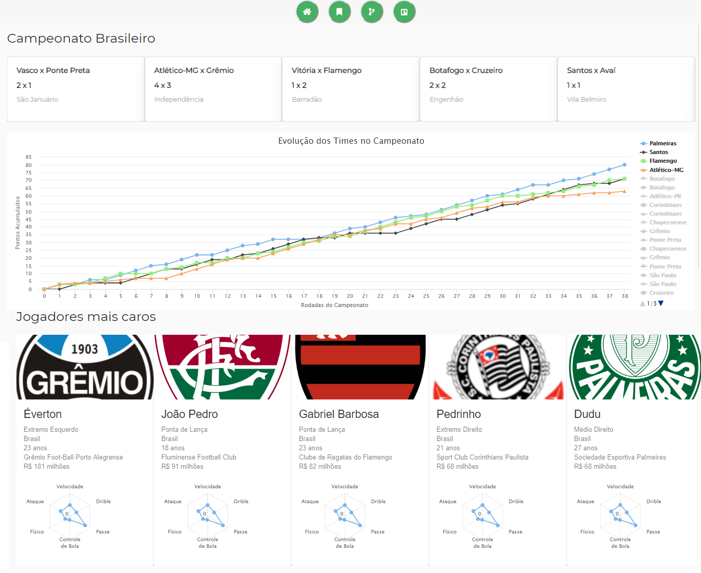

# Futebol
[]() [](/LICENSE)

The main objective of this project is to use technology and data science in the Brazilian Football Championship. You can check the current work on https://trello.com/b/hIgiJDFl/futebol.

This project consists of 3 services:

* __Client:__ Made in __React__ and is responsible for data presentation.
* __Server:__ Made in Python, using __Flask__ microframework for API's.
* __Crawler:__ Made in Python, using __Scrapy__ asynchronous framework for web scraping.

And also the database:
* __No-SQL:__ MongoDB, hosted on Atlas using a EC2 instance on AWS.




## 1) Starting Server

```
cd server
export MONGO_URI=mongodb://[username:password@]host1[:port1][,...hostN[:portN]][/[database][?options]]

pip install -r requirements.txt
python3 run.py
```


## 2) Starting Client

```
cd client

npm install
npm start
```
