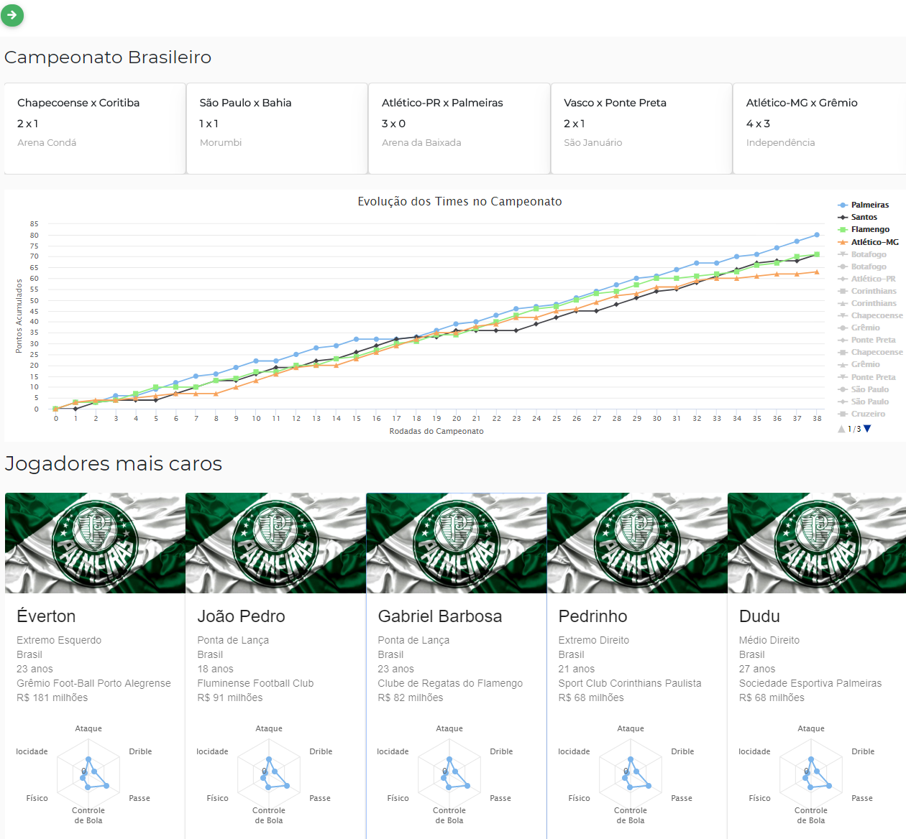

# Futebol
[]() [](/LICENSE)

The main objective of this project is to use technology and data science in the Brazilian Football Championship.

This project consists of 3 services:

* __Client:__ Made in __React__ and is responsible for data presentation.
* __Server:__ Made in Python, using __Flask__ microframework for API's.
* __Crawler:__ Made in Python, using __Scrapy__ framework for web scraping.

And also we got 2 kind of databases:
* __No-SQL:__ MongoDB, hosted on Atlas Cloud.
* __SQL:__ PostgreSQL, hosted on Google Cloud.




## 1) Starting Server

```
cd server

export MONGO_USER=example
export MONGO_PASS=example
export MONGO_HOST=example
export MONGO_DB=example

export PG_USER=example
export PG_PASS=example
export PG_HOST=example
export PG_PORT=example
export PG_DB=example

pip install -r requirements.txt
python3 run.py
```


## 2) Starting Client

```
cd client

npm install
npm start
```
